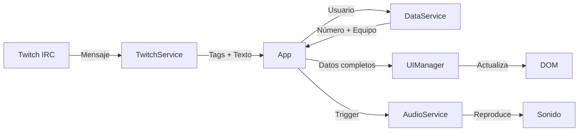

# Twitch Chat Overlay - Estilo F1

Overlay para OBS que muestra los mensajes del chat de Twitch con un diseño inspirado en las radios de equipo de Fórmula 1.

## 📋 Descripción

Esta aplicación web muestra mensajes del chat de Twitch en tiempo real con una estética visual inspirada en las comunicaciones de radio de la Fórmula 1. Cada usuario tiene asignado un número de piloto y un equipo, y los mensajes se muestran con animaciones y efectos visuales.

## 🎯 Características

- ✅ Conexión en tiempo real al chat de Twitch (sin autenticación)
- ✅ Diseño visual inspirado en F1 con colores de equipos
- ✅ Asignación de números de piloto y equipos a usuarios
- ✅ Animación de ecualizador durante los mensajes
- ✅ Soporte para emotes de Twitch
- ✅ Sonido de notificación personalizado
- ✅ Transiciones suaves de entrada/salida
- ✅ Arquitectura modular siguiendo principios SOLID

## 🏗️ Estructura del Proyecto

```
chat twitch/
├── index.html              # Página principal
├── package.json            # Configuración de dependencias
├── package-lock.json       # Versiones exactas de dependencias
├── README.md              # Este archivo
│
├── js/                    # Scripts JavaScript
│   ├── script.js          # Lógica principal (clases y servicios)
│   ├── data.js            # Datos estáticos (equipos, usuarios)
│   └── config.js          # Configuración de la aplicación
│
├── css/                   # Estilos
│   └── styles.css         # Estilos CSS del overlay
│
├── fonts/                 # Fuentes personalizadas
│   ├── MagistralRegular.otf
│   └── MagistralBold.otf
│
└── libs/                  # Librerías externas
    └── tmi.min.js         # Cliente de Twitch IRC
```

## 🔧 Arquitectura Técnica

### Clases Principales (SOLID)

#### 1. **DataService**
Gestiona toda la lógica relacionada con datos de usuarios:
- Asignación de números de piloto
- Asignación de equipos
- Selección aleatoria de equipos

#### 2. **AudioService**
Maneja la reproducción de sonidos:
- Pre-carga del archivo de audio
- Reproducción de notificaciones

#### 3. **TwitchService**
Gestiona la conexión con Twitch:
- Conexión al canal IRC
- Recepción de mensajes
- Manejo de eventos (conexión, desconexión)

#### 4. **UIManager**
Controla toda la interfaz visual:
- Actualización del DOM
- Procesamiento de emotes
- Animaciones de entrada/salida
- Escape de HTML (seguridad XSS)

#### 5. **App**
Clase orquestadora que:
- Inicializa todos los servicios
- Coordina la comunicación entre componentes
- Expone funciones de prueba

### Flujo de Datos



## ⚙️ Configuración

### Archivo: `js/config.js`

```javascript
const CONFIG = {
  TWITCH_CHANNEL: 'liiukiin',        // Canal de Twitch a conectar
  MESSAGE_DISPLAY_TIME: 5000,        // Tiempo de visualización (ms)
  AUDIO_URL: 'https://...',          // URL del sonido
  AUDIO_VOLUME: 1.0,                 // Volumen (0.0 - 1.0)
  EMOTE_SIZE: '1.2em',               // Tamaño de emotes
  MIN_RANDOM_NUMBER: 1,              // Número mínimo aleatorio
  MAX_RANDOM_NUMBER: 99,             // Número máximo aleatorio
  DEBUG: false                       // Modo debug
};
```

### Archivo: `js/data.js`

Define:
- **teams**: Objeto con todos los equipos de F1 (color, logo, ancho)
- **userNumbers**: Mapa de usuarios a números de piloto
- **userTeams**: Mapa de usuarios a equipos

## 🚀 Uso

### 1. Configuración Básica

1. Abre `js/config.js`
2. Cambia `TWITCH_CHANNEL` al nombre de tu canal
3. Ajusta otros parámetros según necesites

### 2. Añadir Usuarios Personalizados

En `js/data.js`:

```javascript
const userNumbers = {
  'nombre_usuario': 44,  // Asignar número específico
  // ...
};

const userTeams = {
  'nombre_usuario': 'ferrari',  // Asignar equipo específico
  // ...
};
```

### 3. Integración con OBS

1. Abre OBS Studio
2. Añade una fuente → **Navegador**
3. Configura:
   - **URL**: Ruta completa a `index.html` (ej: `file:///D:/ruta/chat twitch/index.html`)
   - **Ancho**: 600px
   - **Alto**: 400px
   - ✅ Activar: "Actualizar navegador cuando la escena se hace visible"
4. Ajusta posición y tamaño según tu diseño

### 4. Pruebas en Navegador

1. Abre `index.html` en tu navegador
2. Abre la consola (F12)
3. Ejecuta:
   ```javascript
   window.simularMensaje('Usuario', 'Mensaje de prueba');
   ```

## 🎨 Personalización Visual

### Colores de Equipos

Edita en `js/data.js`:

```javascript
const teams = {
  miEquipo: {
    color: '#FF0000',           // Color principal
    logo: 'https://...',        // URL del logo
    width: '1.6em'              // Ancho del logo
  }
};
```

### Estilos CSS

En `css/styles.css` puedes modificar:
- Variables CSS en `:root`
- Tamaños de fuente
- Animaciones del ecualizador
- Transiciones

## 🔊 Audio

El proyecto usa un sonido de notificación alojado en Cloudinary. Para cambiar el sonido:

1. Sube tu archivo de audio a un servicio de hosting
2. Actualiza `AUDIO_URL` en `js/config.js`

## 🛠️ Desarrollo

### Requisitos

- Navegador moderno (Chrome, Firefox, Edge)
- Conexión a Internet (para Twitch IRC y fuentes externas)

### Dependencias

- **tmi.js**: Cliente IRC de Twitch (incluido en `libs/`)
- **Fuentes Google**: Russo One, Chakra Petch (cargadas desde CDN)
- **Fuente Magistral**: Incluida localmente en `fonts/`

### Modo Debug

Activa el modo debug en `js/config.js`:

```javascript
DEBUG: true
```

Esto mostrará logs detallados en la consola del navegador.

## 📝 Notas Técnicas

### Seguridad

- **Escape de HTML**: Todos los mensajes se escapan para prevenir XSS
- **Conexión anónima**: No requiere autenticación de Twitch
- **Solo lectura**: La aplicación solo lee mensajes, no puede enviar

### Rendimiento

- **Pre-carga de audio**: El sonido se carga al iniciar
- **Caché de DOM**: Referencias a elementos guardadas en memoria
- **Transiciones CSS**: Uso de GPU para animaciones suaves

### Compatibilidad

- ✅ OBS Studio (Windows, Mac, Linux)
- ✅ Streamlabs OBS
- ✅ Navegadores modernos (Chrome 90+, Firefox 88+, Edge 90+)

## 🐛 Solución de Problemas

### El overlay no se conecta a Twitch

1. Verifica que `TWITCH_CHANNEL` esté correctamente escrito
2. Revisa la consola del navegador para errores
3. Comprueba tu conexión a Internet

### Los emotes no se muestran

- Los emotes se cargan desde los servidores de Twitch
- Verifica la conexión a Internet
- Revisa la consola para errores de carga de imágenes

### El audio no suena

1. Verifica que `AUDIO_URL` sea accesible
2. Comprueba el volumen del navegador/OBS
3. Algunos navegadores bloquean autoplay de audio

### Los mensajes no desaparecen

- Verifica `MESSAGE_DISPLAY_TIME` en `js/config.js`
- Revisa la consola para errores de JavaScript

## 📄 Licencia

Este proyecto es de código abierto. Siéntete libre de modificarlo y adaptarlo a tus necesidades.

## 🤝 Contribuciones

Si encuentras bugs o tienes sugerencias de mejora, no dudes en reportarlos.

---

**Desarrollado con ❤️ para la comunidad de streaming**
